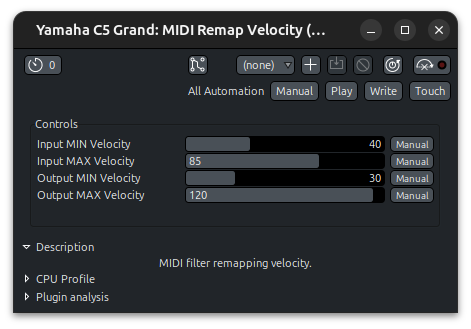

# MIDI Remap Velocity

> type: dsp

Linearly remap the MIDI input velocity from [`Input MIN Velocity`, `Input MAX Velocity`] to [`Output MIN Velocity`, `Output MAX Velocity`] clamped to `[1, 127]`.

## Install

Copy or symlink the `midi_remap_velocity.lua` file to `$ARDOUR_DATA_PATH/scripts`. Check [Scripting > Lua Scripting > Managing Scripts in the Ardour Manual](https://manual.ardour.org/lua-scripting/) for more details.
